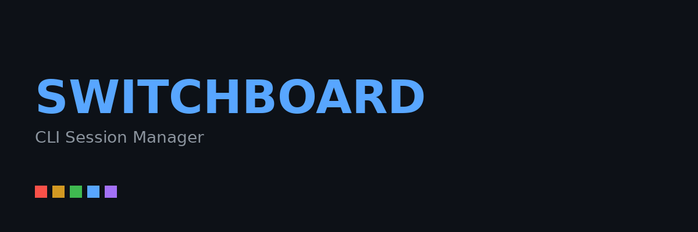
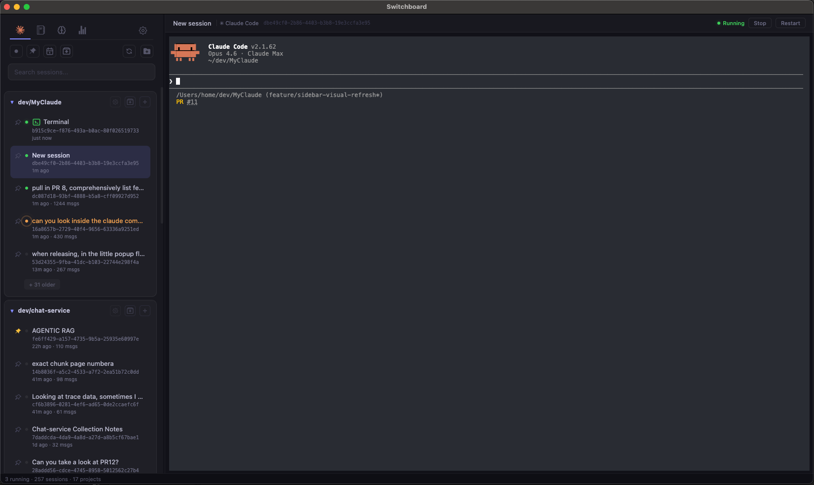

```
   ______       ____________________  ______  ____  ___    ____  ____ 
  / ___/ |     / /  _/_  __/ ____/ / / / __ )/ __ \/   |  / __ \/ __ \
  \__ \| | /| / // /  / / /   / /_/ / __  / / / / /| | / /_/ / / / /
 ___/ /| |/ |/ // /  / / / /___/ __  / /_/ / /_/ / ___ |/ _, _/ /_/ / 
/____/ |__/|__/___/ /_/  \____/_/ /_/_____/\____/_/  |_/_/ |_/_____/  
```

**Your command center for Claude Code sessions.**

Switchboard is a desktop app that gives you a unified view of all your Claude Code sessions across every project. Launch, resume, fork, and monitor sessions from a single window — no more juggling terminal tabs or digging through `~/.claude/projects` to find that one conversation from last week.



---

## 

| Feature | Description |
|---------|-------------|
| **Session Browser** | All your Claude Code sessions, organized by project, searchable by content |
| **Built-in Terminal** | Connect to running sessions or launch new ones without leaving the app |
| **Status Notifications** | In-app alerts when a session is waiting for permission approval or user input |
| **Fork & Resume** | Branch off from any point in a session's history |
| **Full-Text Search** | Find any session by what was discussed, not just when it happened |
| **IDE Emulation** | Acts as an IDE for Claude CLI, showing file diffs in a side panel |
| **Plans & Memory** | Browse and edit your plan files and CLAUDE.md memory in one place |
| **Activity Stats** | Heatmap of your coding activity across all projects |
| **Session Names** | Automatically picks up session names from Claude Code's `/rename` command |

### Session Grid Overview

Toggle the grid overview from the sidebar for a bird's-eye view of all your open sessions at once, grouped by project.


- **Live terminals** — Every open session renders its full terminal in a card
- **Status at a glance** — Running/stopped/busy indicator with timestamps
- **Click to focus, double-click to expand** — Seamless navigation
- **Persistent** — Grid preference saved across restarts

### IDE Emulation (MCP Emulator)

Switchboard can act as an IDE for your Claude Code sessions.


- **Diff review** — Accept or reject file changes directly
- **Inline & side-by-side** — Toggle diff view modes
- **Partial acceptance** — Accept/reject individual chunks in unified view
- **File viewer** — Clickable file links open with syntax highlighting

To disable: Uncheck **IDE Emulation** in **Global Settings**.

### Status Notifications

Monitor all sessions in the background with status indicators.


- **Waiting for input** — Session highlighted when needs response
- **Permission approval** — Badge shows when Claude is blocked
- **Activity indicators** — Running, idle, or finished at a glance

---

## 

| Platform | Download |
|----------|----------|
| **Linux** | [Switchboard-0.0.17.AppImage](https://github.com/aaaronmiller/switchboard/releases/latest) |
| **macOS** | `.dmg` (Apple Silicon & Intel) — *coming soon* |
| **Windows** | `.exe` installer — *coming soon* |

### Linux Installation

```bash
# Download
curl -L -o Switchboard.AppImage \
  https://github.com/aaaronmiller/switchboard/releases/download/v0.0.17/Switchboard-0.0.17-fixed.AppImage

# Make executable
chmod +x Switchboard.AppImage

# Run (or double-click)
./Switchboard.AppImage
```

### Auto-Update

The app checks for updates on launch and every 4 hours via GitHub Releases.

---

## 

### Prerequisites

| Platform | Requirements |
|----------|--------------|
| **All** | Node.js 20+, npm 10+ |
| **macOS** | Xcode Command Line Tools (`xcode-select --install`) |
| **Linux** | `build-essential`, `python3` (`sudo apt install build-essential python3`) |
| **Windows** | Visual Studio Build Tools or `npm install -g windows-build-tools` |

### Quick Start

```bash
# Install dependencies
npm install

# Start development
npm start
```

For faster iteration after first run:
```bash
npm run electron
```

### Build Commands

```bash
# Current platform
npm run build

# Platform-specific
npm run build:mac     # DMG + zip (arm64 + x64)
npm run build:win     # NSIS installer (x64 + arm64)
npm run build:linux   # AppImage + deb (x64 + arm64)
```

Output goes to `dist/`.

### Project Structure

```
.
├── main.js              # Electron main process
├── preload.js           # Context bridge (IPC bindings)
├── db.js                # SQLite session cache & metadata
├── mcp-bridge.js        # MCP protocol bridge
├── package.json          # Dependencies & build config
├── public/              # Renderer (HTML/CSS/JS)
├── scripts/             # Build & postinstall scripts
├── build/               # Icons, entitlements, resources
└── .github/workflows/   # CI/CD pipelines
```

---

## Auto-Sync with Upstream

This fork automatically syncs with [doctly/switchboard](https://github.com/doctly/switchboard):

```bash
# Manual sync (if needed)
git remote add upstream https://github.com/doctly/switchboard.git
git fetch upstream
git merge upstream/main
npm run build:linux
```

A GitHub Action runs daily to auto-merge upstream changes (if no conflicts).

---

## License

MIT — See [LICENSE](LICENSE) for details.
