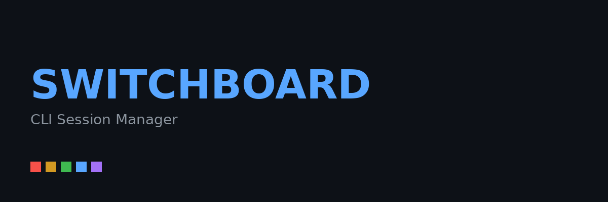
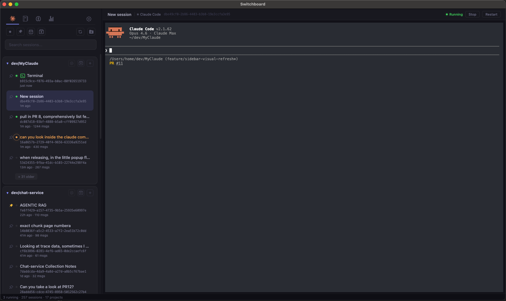

Your command center for CLI coding sessions.

Switchboard is a desktop app that gives you a unified view of all your coding agent sessions across every project. Launch, resume, fork, and monitor sessions from a single window — no more juggling terminal tabs or digging through `~/.claude/projects` and `~/.codex/sessions` to find that one conversation from last week.



### Supported CLIs

| | Claude Code (`claude`) | Codex (`codex`) |
|---|---|---|
| Browse & search history | ✅ | ✅ |
| Resume a session | ✅ | ✅ |
| Start a new session | ✅ | ✅ |
| Fork a session | ✅ | ✅ |
| Read in the message viewer | ✅ | ✅ |
| Status & activity indicators | ✅ | ✅ |
| IDE emulation (diff review) | ✅ | — |
| Plans & memory files | ✅ | — |

Sessions from both CLIs share one sidebar, each row marked with its own logo. A
fork runs on the CLI that wrote the session being forked.

Turn either CLI off under **CLI Agents** in Settings. A switched-off CLI is not
scanned, not watched, not offered when you start a session, and its sessions are
hidden — but its history is kept, so switching it back on restores everything
straight away. At least one CLI always stays on.

### Key Features

- **Session Browser** — All your sessions from every supported CLI, organized by project, searchable by content
- **Built-in Terminal** — Connect to running sessions or launch new ones without leaving the app
- **Status Notifications** — In-app alerts when a session is waiting for permission approval or user input
- **Fork & Resume** — Branch off from any point in a session's history
- **Full-Text Search** — Find any session by what was discussed, not just when it happened
- **Per-CLI Launch Options** — Claude sessions offer permission mode, worktree and Chrome; Codex sessions offer sandbox policy, approval policy and model. Set them per session, per project, or globally
- **IDE Emulation** (Claude only) — Switchboard acts as an IDE for Claude CLI, showing file diffs and opens in a side panel where you can accept, reject, or edit changes before they're applied. Supports both inline and side-by-side diff views. Disable this in Global Settings if you prefer Claude to use your own editor (VS Code, Cursor, etc.)
- **Plans & Memory** (Claude only) — Browse and edit your plan files and CLAUDE.md memory in one place
- **Activity Stats** — Heatmap of your coding activity across all projects
- **Session Names** (Claude only) — Picks up session names from Claude Code's `/rename` command automatically

| Feature | Description |
|---------|-------------|
| **Session Browser** | All your Claude Code sessions, organized by project, searchable by content |
| **Built-in Terminal** | Connect to running sessions or launch new ones without leaving the app |
| **Multi-Agent Management** | Run multiple AI CLI sessions in parallel, bypass per-session token limits |
| **Command Scheduler** | Visual step-based workflow sequencer for orchestrating commands across sessions |
| **Broadcast Mode** | Type once, send to all selected sessions simultaneously |
| **Session Roles** | Tag sessions as `@builder`, `@tester`, `@reviewer` for portable workflow patterns |
| **Pattern Library** | 20+ built-in orchestration recipes across AI, DevOps, and Utility categories |
| **Status Notifications** | In-app alerts when a session is waiting for permission approval or user input |
| **Fork & Resume** | Branch off from any point in a session's history |
| **Full-Text Search** | Find any session by what was discussed, not just when it happened |
| **IDE Emulation** | Acts as an IDE for Claude CLI, showing file diffs in a side panel |
| **Plans & Memory** | Browse and edit your plan files and CLAUDE.md memory in one place |
| **Activity Stats** | Heatmap of your coding activity across all projects |
| **Session Names** | Automatically picks up session names from Claude Code's `/rename` command |

### Session Grid Overview

Toggle the grid overview from the sidebar for a bird's-eye view of all your open sessions at once, grouped by project.


- **Live terminals** — Every open session renders its full terminal in a card, so you can monitor multiple agents simultaneously, whichever CLI each one is running.
- **Status at a glance** — Each card shows a running/stopped/busy indicator dot and last-activity timestamp.
- **Click to focus, double-click to expand** — Click a card header to focus it; double-click to switch back to single-terminal view for that session.
- **Persistent** — Grid preference is saved across restarts.

### Command Scheduler

Switchboard can act as an IDE for your Claude Code sessions. This one is Claude-only — it speaks Claude CLI's own IDE protocol, and Codex sessions are launched without it. When enabled, Claude's file opens and proposed edits appear in a side panel next to the terminal instead of being sent to an external editor.


- **Diff review** — Accept or reject file changes directly
- **Inline & side-by-side** — Toggle diff view modes
- **Partial acceptance** — Accept/reject individual chunks in unified view
- **File viewer** — Clickable file links open with syntax highlighting

To disable: Uncheck **IDE Emulation** in **Global Settings**.

### Status Notifications

Switchboard monitors all your sessions in the background — Claude and Codex alike — and shows status indicators in the sidebar so you can tell at a glance which sessions need attention, even when you're working in a different one.


- **Waiting for input** — A session that needs your response is highlighted so you don't miss it.
- **Permission approval** — When a session is blocked waiting for a permission grant or an approval, its badge lets you know immediately. Switchboard reads each CLI's own wording, so Claude's permission prompts and Codex's approval requests both register.
- **Activity indicators** — See which sessions are actively running, idle, or finished.

## Editor

| Shortcut | Action |
|----------|--------|
| `Cmd+F` / `Ctrl+F` | Find in file (also works in terminal) |
| `Cmd+G` / `Ctrl+G` | Go to line |

## Download

## 

| Platform | Download |
|----------|----------|
| **Linux** | [AppImage + .deb](https://github.com/aaaronmiller/switchboard/releases/latest) (x64 + arm64) |
| **macOS** | [.dmg](https://github.com/aaaronmiller/switchboard/releases/latest) (Apple Silicon + Intel) |
| **Windows** | [.exe installer](https://github.com/aaaronmiller/switchboard/releases/latest) (x64 + arm64) |

- **macOS**: `.dmg` (Apple Silicon & Intel)
- **Windows**: `.exe` installer
- **Linux**: `.AppImage`, `.deb`, or `.pacman` (Arch/Manjaro)

## Prerequisites

- **Node.js** 20+
- **npm** 10+
- Platform build tools for native modules:
  - **macOS**: Xcode Command Line Tools (`xcode-select --install`)
  - **Linux**: `build-essential`, `python3` (`sudo apt install build-essential python3`)
  - **Windows**: Visual Studio Build Tools or `npm install -g windows-build-tools`

## Development Setup

```bash
# Download latest AppImage
curl -L -o Switchboard.AppImage \
  "$(gh release view --repo aaaronmiller/switchboard --json assets -q '.assets[] | select(.name | endswith(".AppImage")) | .url' 2>/dev/null || echo https://github.com/aaaronmiller/switchboard/releases/latest)"

# Make executable & run
chmod +x Switchboard.AppImage && ./Switchboard.AppImage
```

### Auto-Update

The app checks for updates on launch and every 4 hours via GitHub Releases.

---

## 

### Prerequisites

| Platform | Requirements |
|----------|--------------|
| **All** | Node.js 20+, npm 10+ |
| **macOS** | Xcode Command Line Tools (`xcode-select --install`) |
| **Linux** | `build-essential`, `python3` (`sudo apt install build-essential python3`) |
| **Windows** | Visual Studio Build Tools or `npm install -g windows-build-tools` |

### Quick Start

```bash
# Install dependencies
npm install

# Start development
npm start
```

For faster iteration after first run:
```bash
npm run electron
```

### Build Commands

```bash
# Current platform
npm run build

# Platform-specific
npm run build:mac     # DMG + zip (arm64 + x64)
npm run build:win     # NSIS installer (x64 + arm64)
npm run build:linux   # AppImage + deb + pacman (x64 + arm64)
```

Output goes to `dist/`.

### Building on Arch / Manjaro

The `deb` and `pacman` targets are built via the `fpm` binary bundled by
electron-builder, which links against `libcrypt.so.1`. Arch ships `libxcrypt`
without that legacy ABI, so install the compat shim once:

```bash
sudo pacman -S libxcrypt-compat
```

`AppImage` builds without it.

The pacman package is published as **`switchboard-doctly`** rather than
`switchboard` because the Arch `extra` repo already ships a package named
`switchboard` (elementary OS's Pantheon Control Center). Renaming avoids the
file-conflict that would block installation alongside it. The app itself is
still called Switchboard everywhere users see it — only the package identity
changes. Uninstall later with `sudo pacman -R switchboard-doctly`.

## Releasing

```
.
├── main.js                    # Electron main process + scheduler IPC
├── preload.js                 # Context bridge (IPC bindings)
├── db.js                      # SQLite session cache & metadata
├── mcp-bridge.js              # MCP protocol bridge
├── package.json               # Dependencies & build config
├── public/
│   ├── app.js                 # Main renderer (sessions, terminals, grid)
│   ├── scheduler.js           # Command scheduler engine + UI
│   ├── scheduler-patterns.js  # 20+ built-in orchestration patterns
│   ├── style.css              # All styling incl. scheduler step colors
│   ├── index.html             # HTML entry point
│   ├── file-panel.js          # File viewer panel
│   └── codemirror-setup.js    # Editor configuration
├── scripts/                   # Build & postinstall scripts
├── build/                     # Icons, entitlements, resources
├── archive/                   # Stale planning docs and tools (historical reference)
└── .github/workflows/         # CI/CD pipelines
```

---

## Fork: What's Different

This is a fork of [doctly/switchboard](https://github.com/doctly/switchboard) with significant additions for multi-agent orchestration and cross-platform distribution:

| Addition | Description |
|----------|-------------|
| **Multi-agent session history** | 15 CLI tools detected (Claude, Codex, Qwen, Gemini, Kimi, Aider, OpenCode, Hermes, Letta, Amp, Goose, Continue, Cursor, Cline) — session discovery, live IPC handlers, per-agent caching |
| **Multi-agent stacked sidebar** | Toggle (≡) switches between single-agent view and a stacked view showing ALL agents' sessions simultaneously, with collapsible per-agent panels, colored headers, and a pinned section across all agents |
| **Command Scheduler** | 1,375-line visual workflow engine with 9 step types |
| **Pattern Library** | 20+ built-in orchestration recipes (315 lines) |
| **Session Roles & Broadcast** | Tag-based targeting and live input mirroring |
| **Macro Recording** | Capture keystrokes, auto-detect pauses, save as patterns |
| **Peer Messaging Integration** | Scheduler can send peer messages and launch headless sessions as workflow steps |
| **Cross-platform distribution** | CI builds Linux (AppImage, deb, rpm, freebsd), Windows (NSIS installer + portable), and macOS (DMG + ZIP for Intel + Apple Silicon) |

### Auto-Sync with Upstream

A scheduled GitHub Action runs daily for automated upstream sync:

```bash
# Manual sync (if needed)
git remote add upstream https://github.com/doctly/switchboard.git
git fetch upstream
git merge upstream/main
```

Upstream merges follow a careful strategy: the sync workflow restores fork-specific files (`.github/workflows/`, `main.js` customizations, `public/app.js`) after merge, and opens a review PR if conflicts are detected.

---

## License

## Auto-Updates

The app uses `electron-updater` to check for updates from GitHub Releases on launch and every 4 hours. Updates are only checked in packaged builds (not during development). The flow:

1. App auto-downloads updates in the background
2. A toast notification appears when the update is ready
3. User can restart immediately or dismiss (installs on next quit)

## Code Signing

For distribution, set these environment variables:

- **macOS**: `CSC_LINK` (p12 certificate) and `CSC_KEY_PASSWORD`, or sign via Keychain
- **Windows**: `CSC_LINK` and `CSC_KEY_PASSWORD` for EV/OV code signing
- Set `CSC_IDENTITY_AUTO_DISCOVERY=false` to skip signing (CI artifact builds)

The macOS build uses custom entitlements (`build/entitlements.mac.plist`) to allow JIT and unsigned memory execution, required by native modules (node-pty, better-sqlite3).

## Project Structure

```
main.js            Electron main process
preload.js         Context bridge (IPC bindings)
db.js              SQLite session cache & metadata
harnesses/         Per-CLI modules (claude, codex) + registry
public/            Renderer (HTML/CSS/JS)
scripts/           Build & postinstall scripts
build/             Icons, entitlements, builder resources
.github/workflows/ CI/CD
```
